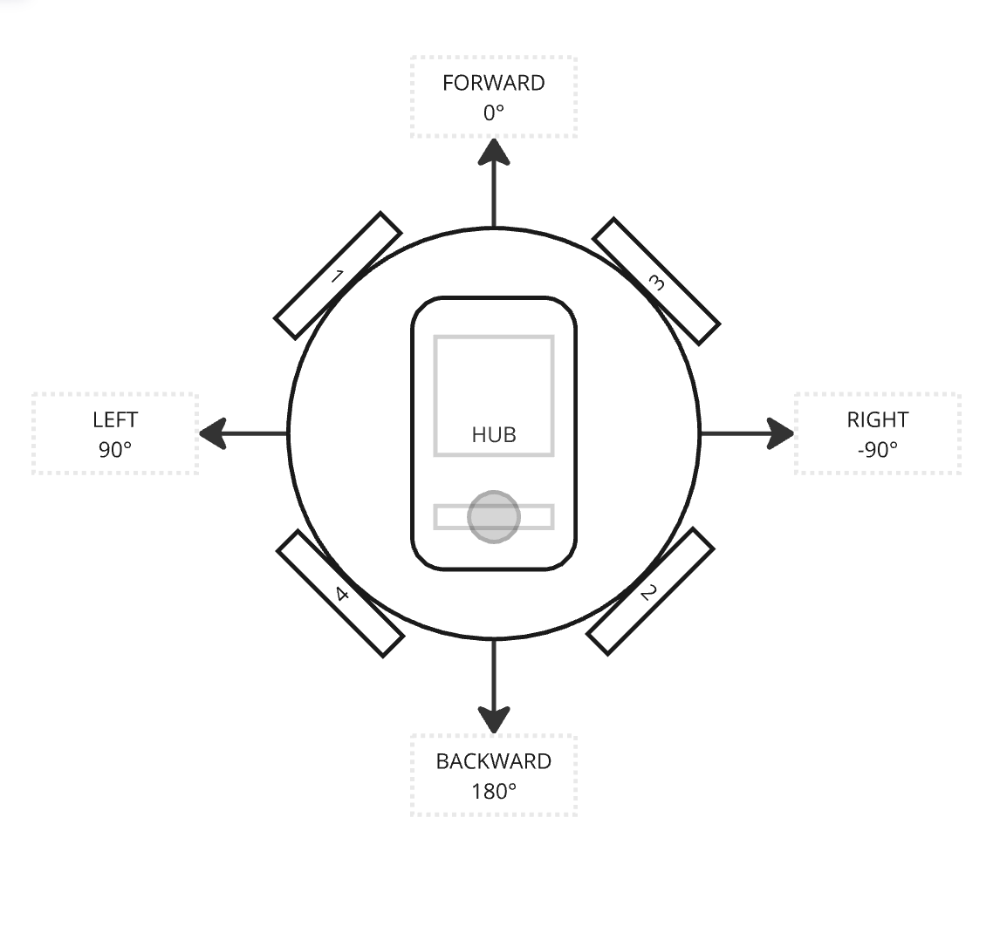
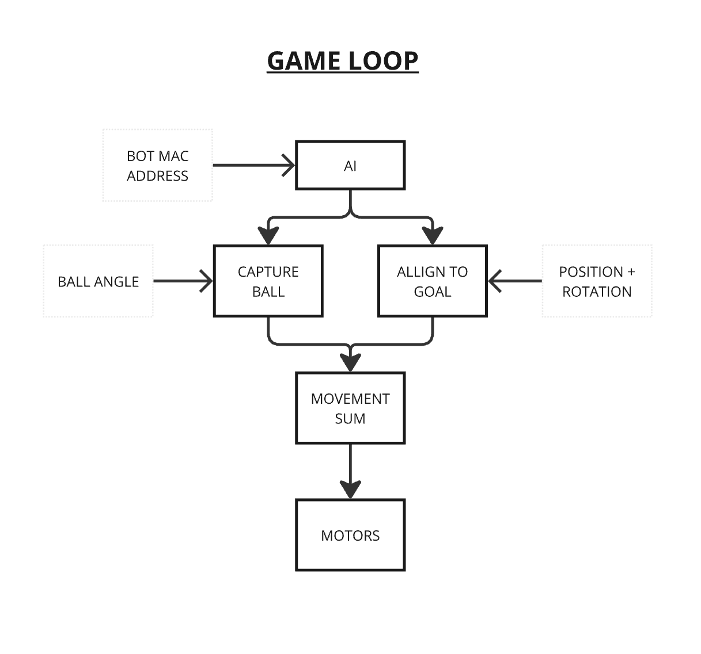
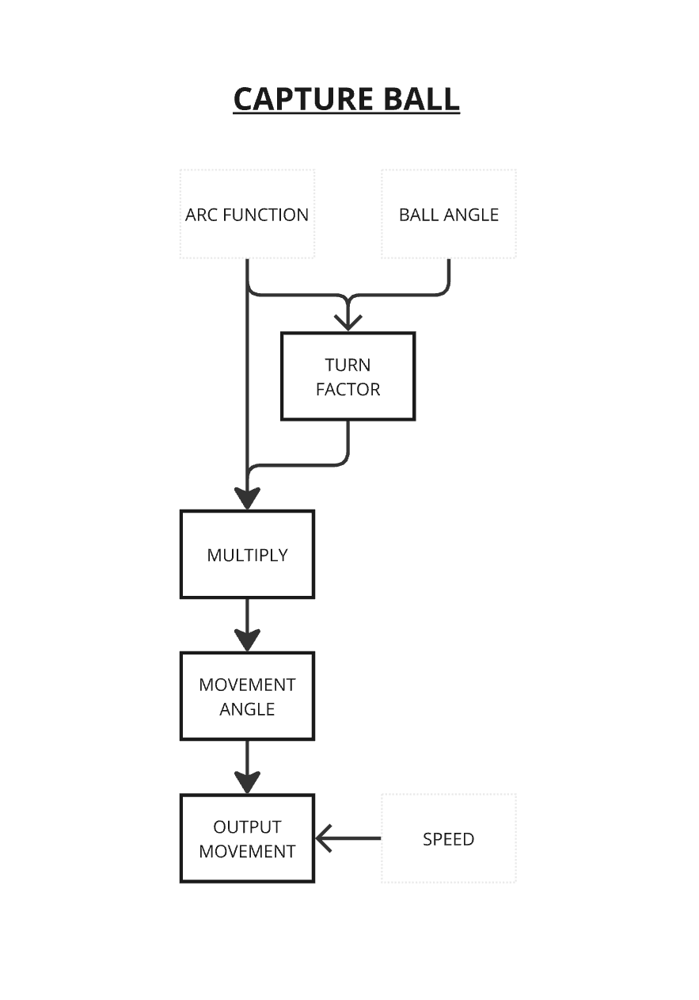
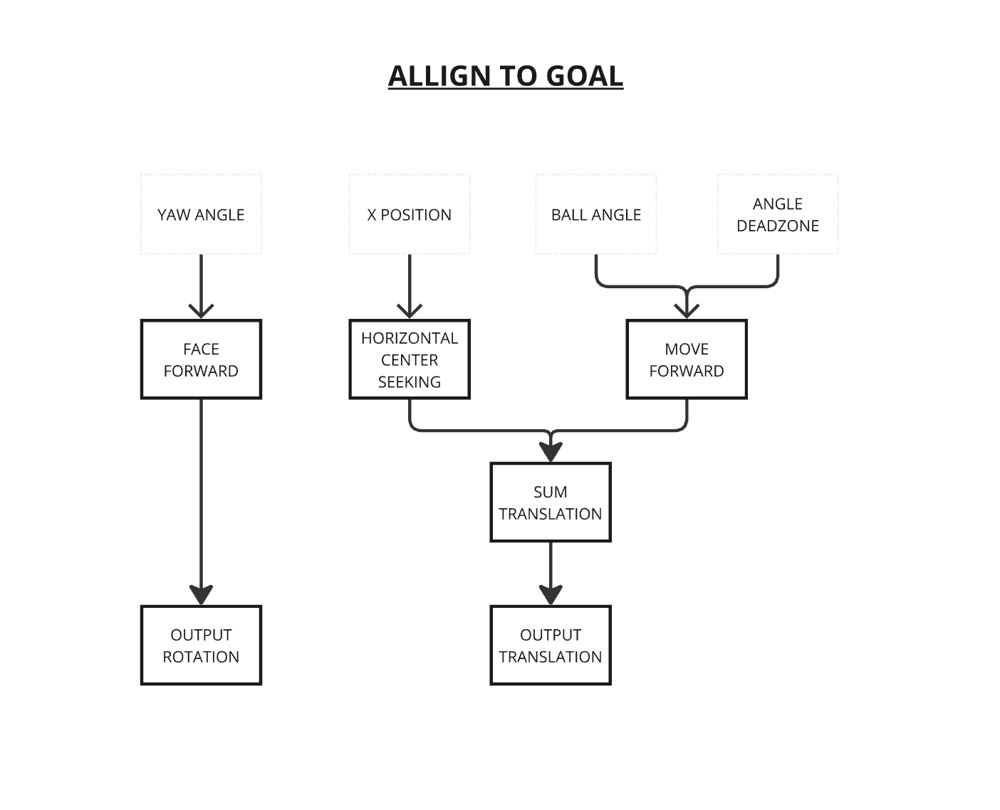
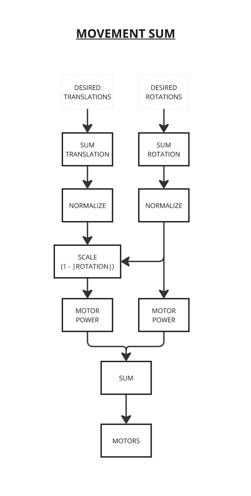

# Bludot
Robot Soccer AI for the LEGO MINDSTORMS robots used by TCC. See the [simulations folder](simulations/) for extra programs used for testing and development. The overall robot ai design is described below.

The program "Bludot" is named after the two robots running it. "Blue" and "Dot", referencing the designs on each of their handles. The program uses the MAC address of each robot's CPU to identify them and change their behaviour.

The idea is that each robot runs the same program, but with different speeds, so that they work together, but one robot stays slightly behind to intercept the other team's attempts to steal the ball.

The shared AI component uses vector sums to combine the following movements with weights corresponding to importance:

1. Center the robot on the field to align with the goal
2. Move to intercept the ball from behind
3. Push the ball forward 
4. Rotate the robot to face the goal

The combined effect of these movements is an fast and efficient goal scoring machine.

Additionally, there are different AI modes that can be selected when starting the robot, allowing us to have some control of the strategy, based on our opponent we can allocate one or both robots as goalies throughout the game.

## Robot Design
The assumed design of the robot, along with motor and direction designatons is shown below. Directions are relative to the wheels. its worth noting that the robot will move fastest on the diagonals between two wheels. The program is also flexible enough to handle different angles between the wheels, as long as opposite wheels are coaxial and parallell. the angle is measured between the right direction and wheel 3 in the diagram, and is assumed to be symetrical. the diagram below shows a wheel angle of 45°.

## Bludot Program
The following are high level diagrams of how the main parts of the AI work:

The main game loop is structured like this, where several movements are calculated and executed at once:

The arc function produces the turning factor that multiplies the angle detected of the ball to produce a desired path around the ball. Visualisations of several arc functions can be simulated [in this folder](simulations/curve_sim) by running the index.html file. by default it compares the hybrid function the lerp arc. you can view the "bad area" where the ball will be knocked the wrong way by pressing space.

Although the movements are summed in the diagram, in practice they are just added to the global sum of movements in the movement sum's class.

The sensor readings for the ball's direction are also interpolated with recursive use of the lerp function to help the bot maintain momentum, this helps avoid sharp turns that will make the bot fall over from interita.

Its important to note that since the translational movement is scaled down to accomodate rotation, the higher the rotation is set the slower the bot will move translationally. in the extreme case when the rotation is 1, the bot will stop moving in order to spin at maximum speed.

